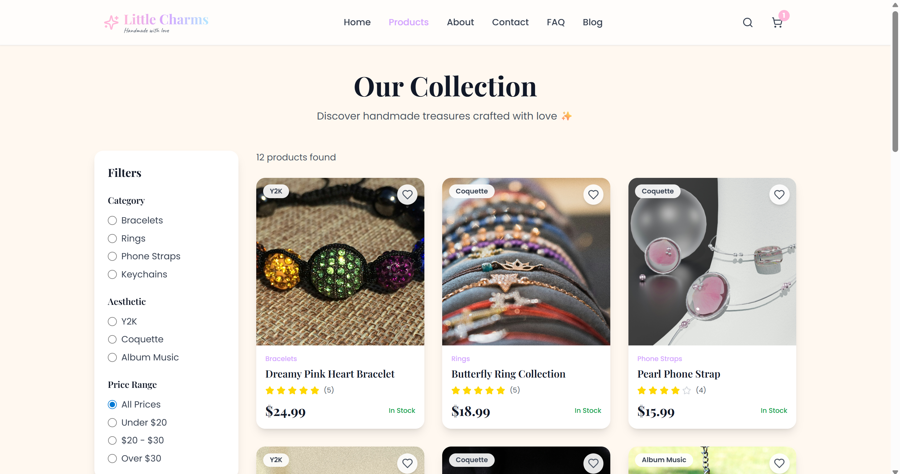

# ✨ Little Charms - Handmade Accessories E-Commerce

**Little Charms** adalah platform e-commerce yang dirancang untuk memasarkan perhiasan tangan (handmade) dan aksesoris kustom. Proyek ini menggabungkan estetika desain modern dengan fungsionalitas belanja digital yang lengkap.

---

## 📸 Screenshots


_Tampilan koleksi Product Little Charms_

## ✨ Fitur Utama

### 🛍️ Katalog & Filtering

- **Product Collection**: Menampilkan produk kategori Bracelets, Rings, Phone Straps, dan Keychains secara dinamis.
- **Aesthetic Filter**: Sistem penyaringan produk berdasarkan tren (Y2K, Coquette, Album Music) untuk memudahkan user mencari gaya tertentu.
- **Stock Management**: Status ketersediaan barang (In Stock) yang terupdate secara otomatis.

### 🛒 Shopping Cart System

- **Dynamic Cart**: Mengelola item belanja melalui `CartContext` yang memungkinkan penambahan atau pengurangan jumlah produk secara instan.
- **Order Summary**: Kalkulasi otomatis untuk subtotal, biaya pengiriman (Free), dan pajak (8%) hingga total akhir.
- **Seamless Checkout**: Halaman integrasi pembayaran yang aman.

### 📖 Branding & Informasi

- **Our Story**: Halaman profil bisnis yang menjelaskan perjalanan brand sejak tahun 2023.
- **Blog & Tips**: Edukasi pelanggan mengenai tren fashion terbaru dan cara merawat aksesoris handmade.
- **Contact & FAQ**: Sistem bantuan pelanggan terpadu melalui form kontak dan daftar pertanyaan umum.

## 🛠️ Tech Stack

- **Framework:** React.js (Vite)
- **Styling:** Tailwind CSS & PostCSS
- **State Management:** React Context API (CartContext)
- **Icons & Fonts:** Lucide React / Google Fonts

## 📁 Struktur Folder

Berdasarkan arsitektur proyek:

- `src/`: Source code utama aplikasi.
  - `components/`: Komponen UI (Navbar, Product Card, Footer).
  - `context/`: Logika utama untuk manajemen keranjang belanja (`CartContext.jsx`).
  - `data/`: Penyimpanan data produk statis (`products.js`).
  - `image/`: Asset gambar produk
  - `lib/`: Fungsi utilitas tambahan (`utils.js`).
  - `pages/`: Halaman utama (Home, Shop, Blog, Cart).

1. **Instal dependensi:**

```bash
npm install
```

2. **Jalankan mode development:**

```bash
npm run dev
```

## 🚀 Cara Instalasi

Pastikan kamu sudah menginstal **Docker** dan **Docker Compose** di perangkatmu.

**Clone repositori ini:**

```bash
git clone [https://github.com/dfulndri/LittleCharms-E-Commerence.git](https://github.com/dfulndri/LittleCharms-E-Commerence.git)
cd web_littlecharms
```
